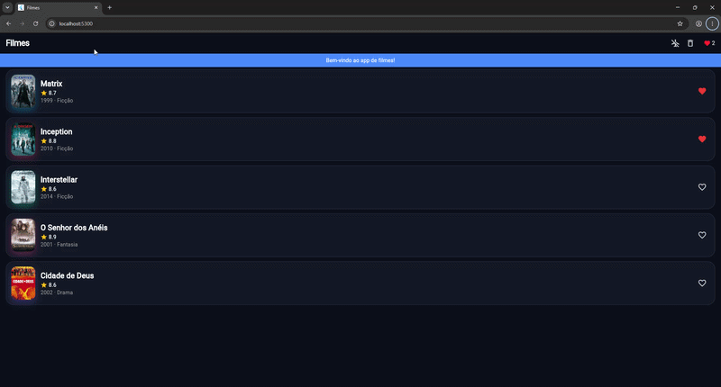

# Filmes (Flutter) — pratica/ da Atividade 3

App de catálogo de filmes em **Flutter**. Já roda; você completa os scaffolds (UI, estado, Firebase e offline-first) até `flutter test` ficar **verde**.

## Rodar
```bash
cd exercicios/03-flutter-ui-estado/pratica   # confirme: ls lib
flutter pub get
flutter run -d chrome --web-port 5300   # PORTA FIXA (o cache offline fica no navegador, por porta)
# 💡 Atalho no VS Code: aperte F5 (o .vscode/launch.json já fixa a porta 5300)
#    ou Ctrl/Cmd+Shift+B (terminal integrado: r = hot reload) · ./rodar.sh (Mac/Linux) · rodar.bat (Windows)
```

## Testar (é o seu checklist)
```bash
flutter test                         # tudo: Ex1–Ex3 (UI/estado) + offline (TASKs 11–15) + checklist
flutter test test/offline_test.dart  # só offline-first — cada grupo = 1 TASK
flutter analyze                      # precisa ficar limpo
```
Comece com os testes **vermelhos**; deixe-os **verdes**. `test/checklist_test.dart` e `test/offline_test.dart` são a **spec** (não edite).

## Estado local × cloud × offline-first (trade-offs)

Este app usa as três abordagens, cada uma com seu preço. O estado **local** (o `favoritesProvider` do Riverpod em memória e o `SharedPreferences`, que no navegador vira `localStorage`) responde na hora e funciona sem internet, mas fica preso a um único aparelho/navegador: troque de device ou limpe os dados do site e ele some. O estado na **cloud** (o documento `favorites/meus-favoritos` no Firestore) sincroniza entre dispositivos e sobrevive ao refresh, mas toda leitura e escrita depende de rede, tem latência e consome cota — por isso o `toggle` é *otimista*: a UI muda primeiro e a gravação no Firestore vai em paralelo. O **offline-first** junta o melhor dos dois: o Firestore com `persistenceEnabled` guarda uma cópia local, o `MovieRepository` mostra o cache do aparelho imediatamente e só vai à API quando o cache passa do TTL (10 min), e a `SyncQueue` guarda as escritas feitas sem rede para enviá-las em ordem quando a conexão volta. O custo é complexidade e **consistência eventual**: o usuário pode ver dados de até 10 minutos atrás, a fila precisa sobreviver ao app fechando no meio do envio, e conflitos exigem regra explícita (aqui, favoritar e desfavoritar o mesmo filme se anulam antes de chegar ao servidor).

## Evidência — favoritos sobrevivem ao refresh (Firestore)



## O que completar (🧑‍🏫 aula · 🧑‍💻 casa)
| TASK | Arquivo | O quê | |
|---|---|---|---|
| 1 | `lib/widgets/movie_card.dart` | compor o card (título + ⭐ nota + ano) | 🧑‍🏫 |
| 2 | `lib/state/favorites.dart` | `favoritesProvider` (`toggle` + `clear`) | 🧑‍🏫 |
| 3 | `lib/main.dart` | projeto Firebase + `flutterfire configure` | 🧑‍🏫 |
| 10 | `lib/main.dart` | persistência offline do Firestore (1 linha) | 🧑‍🏫 fácil |
| 4 | `lib/widgets/movie_card.dart` | coração favoritando (`ConsumerWidget` + `ref`) | 🧑‍💻 |
| 5 | `lib/screens/home_screen.dart` | contador `♥ N` no header | 🧑‍💻 |
| 6 | `lib/screens/home_screen.dart` | botão **limpar** favoritos | 🧑‍💻 |
| 7 | `lib/state/favorites.dart` | persistir favoritos no **Firestore** | 🧑‍💻 médio |
| 8 | `lib/services/remote_config.dart` + home | banner via **Remote Config** | 🧑‍💻 médio |
| 9 | `test/favorites_test.dart` | **você escreve** um teste do provider | 🧑‍💻 |
| 11 | `lib/widgets/offline_banner.dart` | aviso "você está offline" | 🧑‍💻 fácil |
| 12 | `lib/models/movie.dart` | `toJson` / `fromJson` | 🧑‍💻 fácil |
| 13 | `lib/data/movie_repository.dart` | repositório **cache-first** | 🧑‍💻 médio |
| 14 | `lib/data/movie_repository.dart` | validade do cache (**TTL**) | 🧑‍💻 médio |
| 15 | `lib/data/sync_queue.dart` | **fila de sincronização** (conflitos + flush) | 🧑‍💻 🔴 difícil |

✈️ O botão de **avião** na barra do topo simula o modo offline. Veja o `guia-passo-a-passo.md` e o `enunciado.md` (rubrica).

## Entrega
Fork + PR no repo público; link no Canvas. O **J.A.R.V.I.S.** lê o seu código (estrutural) e posta uma nota **mínima**; a final sai no Canvas.
- ✏️ **Edite os arquivos dentro de `exercicios/03-flutter-ui-estado/pratica/` (no lugar)** — **não crie subpasta** `aluno-.../`.

> **CI no seu fork (opcional):** habilite o *Actions* do fork — o workflow *Flutter test — Atividade 3* roda `flutter analyze` + `flutter test` a cada push.
> **Versões:** precisa de Flutter **3.27+** (o `pubspec` já avisa se for mais antigo).

> **Não comite** `.dart_tool/`, `build/`, `pubspec.lock` (já no `.gitignore`).

## Dados reais do TMDB (opcional)

Sem chave, o app usa a lista simulada (5 filmes). Para filmes reais: copie `.env.local.example` → `.env.local`,
cole sua chave do TMDB (`TMDB_KEY=...`) e rode `./rodar.sh` / `rodar.bat` (ou F5 → "dados reais TMDB").
O `.env.local` não vai pro git. Os testes (`flutter test`) nunca usam a chave.
